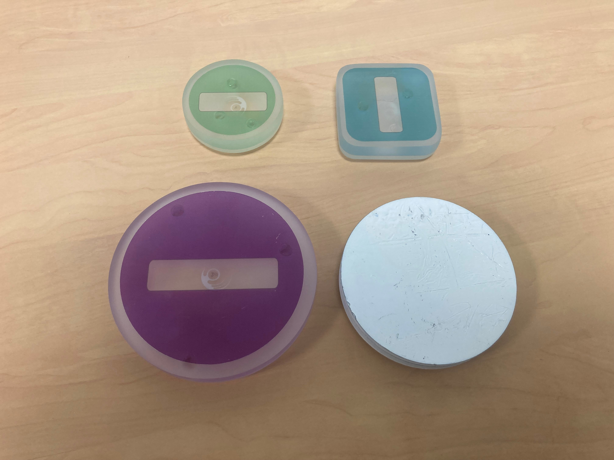
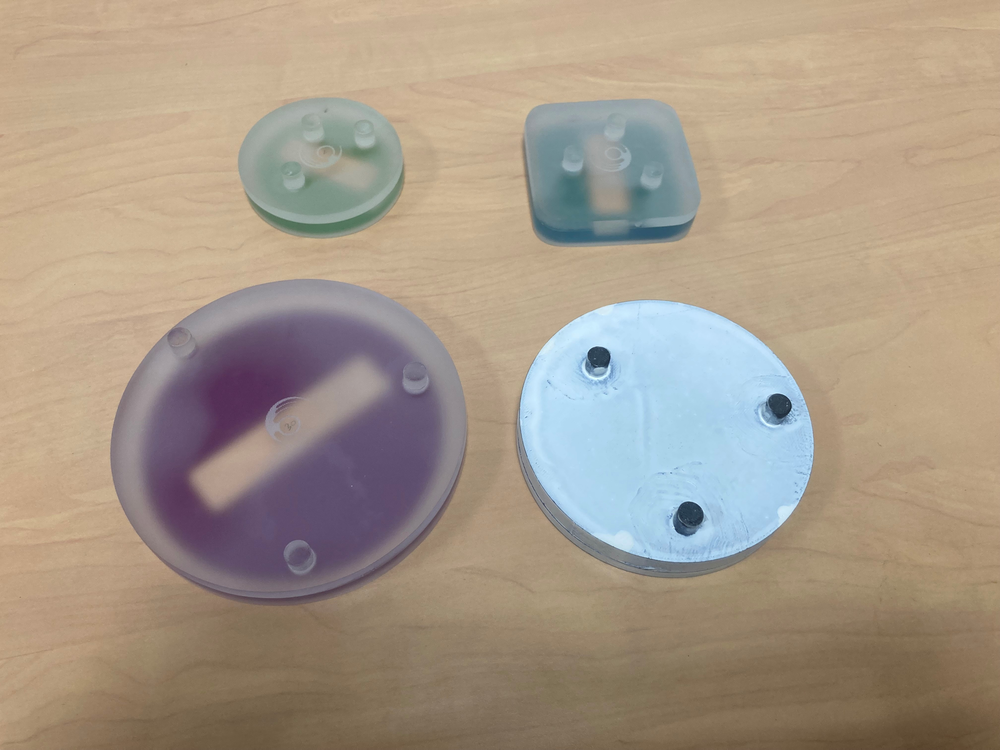
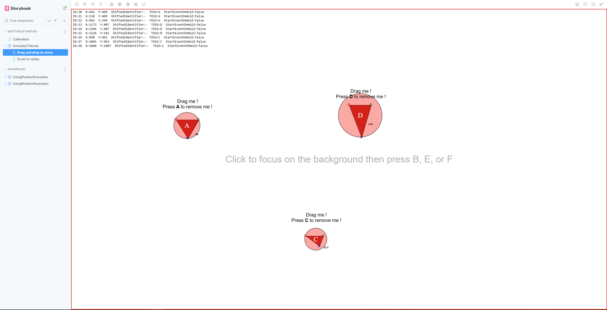

# React Tangible Object Library

`react-tangible-object` is a React library for detecting tangible objects on a touchscreen in a web application. It provides custom events to allow anyone to use tangible objects in their own React code. It also provides debugging tools for simulating tangible objects and seeing how touch events are being processed by the library.

#### Authors : Aurélien Marchal, Louis-Pierre Bergé, Philippe Limousin, Radhouene Azzabi

Link to related scientific paper coming soon





---

## Installation (npm)

And install with npm :

```bash
npm install @ctreg-docc-digit/react-tangible-object
```

---
## Detection

For a web browser, there is no difference between three fingers placed on a touch surface and a tangible object placed on a touch table. The only information available to the browser about the contact points is their position on the screen (some touchscreens also provide force and size values for the contact points, but these are not used in our library). The library's function is to determine, based on the placement of the various contact points on the screen, which ones originate from a tangible object and which are generated by one or more fingers.

The only way to determine if three contact points have been generated by a tangible object (and by which tangible object) is to know in advance the distance between the three feet of all the tangible objects we are trying to detect. It is then possible to calculate the distance between all pairs of contact points present on the screen and determine if a triplet of distances between three points matches (within a small tolerance, epsilon) one of the known triplets of distances between the feet of the tangible objects. If a triplet of distances matches a tangible object, then the three contact points associated with the distance triplet are marked as belonging to a tangible object. The remaining points are marked as being generated by a finger.

To determine if a measured triplet of distances matches, within a tolerance (epsilon), one of the known triplets of distances between the feet of the tangible objects, the following procedure is used: the sum of the three differences between the measured triplet and each reference triplet for each tangible object is calculated. Then, the tangible object with the smallest sum of differences is identified. If this smallest sum is less than epsilon, the corresponding object is recognized. This strategy was chosen because it favors false positives (three fingers being recognized as a tangible object) over false negatives (a placed object not being recognized). Additionally, it allows for the evaluation of all possible tangible objects and finding the one that best matches the measured distances, thus greatly reducing the chances of detecting one tangible object instead of another.

When the browser receives a new contact point, it assigns it a unique identifier corresponding to its order of appearance. The first contact point has identifier 0, the second has identifier 1, and so on. The identifier remains unchanged even when a contact point with a lower identifier disappears. If a new contact point appears, the numbering restarts from the first available natural number. This unique identification allows determining only once if a contact point belongs to a tangible object. It is then sufficient to note for each identifier whether it belongs to a tangible object and, if so, to which tangible object. In this way, each time a contact point appears, the previously described calculation is performed only on the contact points that have not already been marked as belonging to a tangible object. Similarly, each time a contact point disappears, it is possible to know if it belonged to a tangible object thanks to its identifier.

A tangible object is considered removed from the table by the library when two or more of its feet are lifted from the touch surface. This choice was made because it often happens that a user manipulating a tangible object lifts one of its feet without intending to. In this case, the library notes that a contact point is missing from the tangible object. When the library detects a new contact point, it first tries to see if it can correspond to tangible objects that are missing a contact point, and then it tries to see if it belongs to a new tangible object.

---
## Event Handling

There are three types of `TouchEvent`: `touchstart`, `touchmove`, and `touchend`. Similarly, we have created three types of tangible object events: `TOStartEvent` when the object is placed, `TOMoveEvent` when the object is moved, and `TOEndEvent` when the object is removed from the touch surface. All these events are of the same type, [TOEvent](#types), and contain the following information: the position of the centroid of the tangible object, the radius of the tangible object (in pixels), and the rotation angle of the tangible object (in degrees; corresponding to the angle between one of the sides of the triangle formed by the feet of the object and the X-axis of the web page). When a `TouchEvent` of type `touchstart` is detected as being caused by a tangible object, it is not transmitted; instead, a tangible object event `TOStartEvent` is sent. The same process is applied for touchmove and touchend.

The event management of the library is as follows: (1) listen for Touch events during the Bubble Down phase before they are transmitted to the child components; (2) determine if the event was caused by a tangible object or by a finger; (3) if the event was caused by a tangible object, stop the event propagation and create a tangible object event instead. If the event was caused by a finger, allow the event to propagate to the child components as if the library did not exist.

---

## Storybook

A Storybook is available here : https://main--686d2fa236821ed6b553822b.chromatic.com

It contains 3 main parts.

#### Calibration

In this part, you can calibrate tangible objects to your current touch screen. In order to do that, you just need to place your tangible object on the Story and keep moving and rotating the object until the calibration is complete. The calibration story will avarage the distance between the three feet of the tangible object over every touchmove that it has received. Once the calibration is over, write the three distance of the tangible object in your `tangibleObjectDataList` in any order and set an `id` to the tangible object you just calibrated (and a `simulatorKey` to make it appear in the simulator).

If one of the foot of the tangible object is lifted up during the calibration, you will be asked to restart the calibration. However, if you consider that the calibration was long enough, just write down the three distances anyway, the calibration does not need to be super precise. If you need to restart, just use the refresh button of Storybook at the top of the Story.

Once the calibration is finished, you can use the calibrated tangible object in the rest of the stories of the Storybook. To do that, set an `id` and a `simulatorKey` in the Control panel of the story (below the story) and click on the button that just appeared. If everything worked correctly, you should be able to use your tangible object in the rest of the stories.

#### Simulator Tutorial

This part is a quick tutorial on how to use the simulator. It is usefull if you want see what the library can do without having tangible objects.

#### Examples

The rest of the Storybook is just simple examples that show the features of the library. You can try them out with your own calibrated tangible object or with the simulator.

--- 
## Documentation
### Components

The code is divided into four main React components, two of which are required for the library to work. 

- `TOSimulator` (optional) 

#### `<TOContext />` (required)
Allows all child components to access the list of tangible objects currently present on the touch surface. 

#### `<TOInput />` (required)
Is the core of the library; it manages `TouchEvent` to determine which ones are part of a tangible object and sends the associated tangible object events.
| Prop| Type| Description|
|---------------|------------------|--------------------------|
|`precision`|`number`|(in px) The precision factor of the tangible object detection. [More details](#detection)|
| `tangibleObjectDataList`|`TangibleObjectData[]`| The list of calibrated tangible objects that can be detected by the library. [More details](#detection)|
| `touchHandlingMode`|`TouchHandlingMode`| The strategy of how to handle touch events that are not created by a tangible object. Default is 'Standard'. [More details](#types)|
| `simulateClicks`| `boolean`| Whether or not to send a click event when a touchstart and a touchend with the same identifier are detected as not being created by a tangible object. Default is 'false'|
|`maxDistanceForClick`|`number`|(in px) The maximum distance between a touchstart and a touchend to simulate a click. Default is 20|

#### `<TOSimulator />` (optional)
Is a development or debugging tool that allows simulating tangible objects to test the library without a touchscreen. By pressing a keyboard key (stored in the `TangibleObjectDataList`), a circle appears and can be moved by drag and drop. The `TOSimulator` component then sends Touch events as if a real tangible object were placed on a table. You can also rotate the simulated tangible object by turning the mouse wheel. [link to the simluator tutorial]


| Prop| Type| Description|
|---------------|------------------|--------------------------|
| `tangibleObjectDataList` | `TangibleObjectData[]`| The list of tangible objects that can be simulated. In order for a tangible object to be recognized by the library, it needs to appear in the tangibleObjectDataList of the TOInput component|


#### `<TOCanvas />` (optional)
Provides a simple visual feedback of the tangible objects to quickly see if the objects are recognized or not, which is useful for development or debugging as it provides information on the position and rotation of the recognized objects and also how the touch event are being categorized.
| Prop| Type| Description|
|---------------|------------------|--------------------------|
| `zIndex`| `number`| The css property zIndex. Can be usefull to display the canvas on top of other divs. Default is 1|


TOSimulator + TOCanvas : 



---

### Types

#### `TouchHandlingMode`
Defines the three ways the library handles the touch events that are detected as not being created by a tangible object.


```typescript
type TouchHandlingMode = "Standard" | "TOOnly" | "RetainStartEvent";
```

- **TOOnly**: The library will ignore and not propagate touch events that are detected as not originating from a tangible object.
- **Standard**: The library will propagate touch events that are not generated by a tangible object, but it will adjust the touch identifiers of these propagated events. The original target of the touch events will only receive events that are not generated by tangible objects, as if no tangible objects are present. This includes shifting the touch identifiers. For example, if a tangible object produces touches with identifiers 0, 1, 2, and a user produces a touch with the identifier 3 with its finger, only the touch event with the identifier 3 will be propagated, and its identifier will be shifted to 0.
- **RetainStartEvent**: When placing a tangible object on a touch surface, users typically place the feet one at a time in quick succession. This means that before all three feet are placed on the surface and the tangible object can be detected, two touches are produced by the first two feet that will never be recognized as part of a tangible object. This can result in unwanted touches when placing a tangible object. To fix this, this mode uses timing to prevent such unwanted touches. It does not propagate `touchstart` events immediately but holds them for 50 milliseconds. After this period, it checks if another `touchstart` event has occurred or if a tangible object can be detected. If neither condition is met, the `touchstart` events are propagated to their respective targets, but with a 50-millisecond delay and by using the same identifiers shifting as in the `standard` mode. 

#### `TangibleObjectData`
Represents the data for a tangible object. It is used to specify which tangible object can be detected. 
The `id` has to be unique to every TO. The `simulatorKey` defines which key to press to  in the `TOSimulator` component to make the corresponding simulated tangible object appear. The `distAB`, `distBC` and `distCA` can be any of the three distances between the feet of the tangible object. To obtain the three distances, use the calibration in the storybook : [link].
NB 1 : the angle of the tangible object is calculated as the angle of the AB segment in regard to the x axis of the screen  
NB 2 : the distances are in pixel and **are dependant on the touch screen used**. The three distances obtained in the calibration can be different if you are using a different screen. They are however not dependant on the window size of the browser.
```typescript
interface TangibleObjectData {
    id: string;
    simulatorKey?: string;
    distAB: number;
    distBC: number;
    distCA: number;
}
```

#### `Point`
Represents a point in 2D space.
```typescript
interface Point {
    x: number;
    y: number;
}
```

#### `TangibleObject`
The class representing a tangible object.
- **id** : The given id of the tangible object in the `tangibleObjectDataList` prop of the `TOInput` component.
- **touchA** : The last touch detected as corresponding the A point of the tangible object. (the A B C points are defined in the `tangibleObjectDataList` prop of the `TOInput` component). 
- **touchB** : The last touch detected as corresponding the A point of the tangible object. (the A B C points are defined in the `tangibleObjectDataList` prop of the `TOInput` component)
- **touchC** : The last touch detected as corresponding the A point of the tangible object. (the A B C points are defined in the `tangibleObjectDataList` prop of the `TOInput` component)
- **realDistAB** : The distAB defined in the `tangibleObjectDataList` prop of the `TOInput` component.
- **realDistBC** : The distBC defined in the `tangibleObjectDataList` prop of the `TOInput` component.
- **realDistCA** : The distCA defined in the `tangibleObjectDataList` prop of the `TOInput` component.
- **angle** : (in degrees) The angle of the AB segment in regard to the x axis of the screen.
- **triangle** : The triangle formed by the clientX and clientY of the touchA, touchB and touchC.
- **radius** : (in px) The maximum distance between the barycentre and any of the point on the triangle.
- **angleA** : The angle of the triangle at the A point.
- **angleA** : The angle of the triangle at the B point.
- **angleA** : The angle of the triangle at the C point.

```typescript
class TangibleObject {
    public id: string;
    public touchA: React.Touch | null;
    public touchB: React.Touch | null;
    public touchC: React.Touch | null;
    public realDistAB: number;
    public realDistBC: number;
    public realDistCA: number;
    public angle: number;
    public triangle: Triangle;
    public radius: number;
    angleA: number;
    angleB: number;
    angleC: number;
}
```

#### `Triangle`
Represents the triangle formed by the three feets of the tangible object.
```typescript
class Triangle {
    A: Point;
    B: Point;
    C: Point;
    distanceAB: number;
    distanceBC: number;
    distanceCA: number;
    barycentre: Point;
}
```

#### `TOEvent`
Tangible object event.
- **idTO** : The given id of the tangible object in the `tangibleObjectDataList` prop of the `TOInput` component.
- **barycentre** : (in px) the barycenter of the triangle formed by the three feets.
- **angle** : (in degrees) the angle of the AB segment in regard to the x axis of the screen.
- **radius** : (in px) the maximum distance between the barycentre and any of the point on the triangle.

```typescript
interface TOEvent {
    idTO: string;
    barycentre: Point;
    angle: number;
    radius: number;
}
```

#### `StartEvent`
Start event for a tangible object.
```typescript
interface StartEvent extends TOEvent {}
```

#### `EndEvent`
End event for a tangible object.
```typescript
interface EndEvent extends TOEvent {}
```

#### `MoveEvent`
Move event for a tangible object.
```typescript
interface MoveEvent extends TOEvent {}
```

#### `InternalContextDescriptor`
The type of the tangible object list context.

```typescript
interface InternalContextDescriptor {
    tangibleObjects?: Array<TangibleObject>;
    setTangibleObjets: (tangibleObjects: Array<TangibleObject>) => void;
}
```

---

## Hooks

### `useTOContext()`
Hook for the tangible object list context provided by the `TOCanvas` component. [Example](#using-tocontext).
```typescript
const context = useTOContext();
```

### `useTOMonitor(listener: TOMonitorListener)`
Hook to listen to the `TOEvent`. [Example](#listening-to-to-events).
```typescript
useTOMonitor(listener);
```

---

## Examples

### Basic TO Setup

`TOCanvas` and `TOSimulator` are optional.

```jsx

import { TOCanvas, TOContext, TOInput, TOSimulator } from '@ctreg-docc-digit/react-tangible-object';


import tangibleObjectDataList from './tangibleObjectData.json';


const App = () => {
  
  return (
        <div>
            <TOSimulator tangibleObjectDataList={tangibleObjectDataList}>
                <TOContext>
                    <TOInput precision={200} tangibleObjectDataList={tangibleObjectDataList} touchHandlingMode='Standard'>
                        <TOCanvas></TOCanvas>
                        <ComponentUsingTO/>
                    </TOInput>
                </TOContext>
            </TOSimulator>
        </div>
    );
};

```

`tangibleObjectData.json` : 

```json
[
    {
        "id": "TO_A",
        "simulatorKey": "A",
        "distAB": 96,
        "distBC": 94,
        "distCA": 92
    },
    {
        "id": "TO_B",
        "simulatorKey": "B",
        "distAB": 112,
        "distBC": 104,
        "distCA": 108
    },
    {
        "id": "TO_C",
        "simulatorKey": "C",
        "distAB": 73,
        "distBC": 47,
        "distCA": 75
    },
    {
        "id": "TO_D",
        "simulatorKey": "D",
        "distAB": 144,
        "distBC": 93.8,
        "distCA": 148.2
    }
]
```

### Listening to TO events

CodeSandBox ?

```jsx

import { useTOMonitor } from '@ctreg-docc-digit/react-tangible-object';

const ComponentUsingTO = () => {
    useTOMonitor({
        onTOStart(event) {
            console.log("Start event", event);
        },
        
        onTOMove(event) {
            console.log("Move event", event);
        },

        onTOEnd(event){
            console.log("End event", event);
        }
    });
    
}

```

### Using TOContext

CodeSandBox ?

```jsx

import { useTOContext } from '@ctreg-docc-digit/react-tangible-object';

const ComponentUsingTO = () => {

    const {tangibleObjects} = useTOContext();

    useEffect(() => {
        if(!tangibleObjects){
            return;
        }
        console.log(tangibleObjects);
    }, [tangibleObjects]);

}

```

## Known compatible libraries 

- https://www.npmjs.com/package/react-leaflet

## Known incompatible libraries 

- https://www.npmjs.com/package/@dnd-kit/react

## Browser compatibility